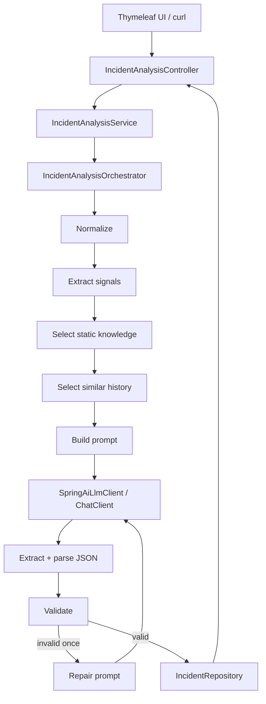

# AI Incident Assistant

Compact Spring Boot take-home service that helps on-call engineers analyze manually submitted production incidents with a controlled LLM pipeline.

## Purpose

An engineer pastes an incident description. The service returns:

- category
- concise summary (what is happening / who is affected)
- severity (`LOW` | `MEDIUM` | `HIGH`)
- 1–3 root-cause hypotheses with reasoning and 2–3 diagnostic next steps

This is **not** live monitoring. There is no ELK/Prometheus/Grafana integration and no automatic remediation.

## Stack

- Java **25**
- Spring Boot **4.1.0**
- Spring MVC + Validation
- Thymeleaf demonstration UI
- **Spring AI 2.0** (`spring-ai-starter-model-openai`) via `ChatClient`
- Actuator health
- springdoc OpenAPI

No PostgreSQL, JPA, Flyway, Testcontainers, Kafka or Redis.

## Architecture



### Explicit agent stages

1. Validate request (Bean Validation)
2. Normalize description
3. Extract deterministic signals
4. Select relevant static system knowledge
5. Select up to 3 relevant previous analyses from in-memory history
6. Build prompt with trusted/untrusted delimiters
7. Call LLM
8. Extract JSON (quote/brace aware)
9. Deserialize into typed model
10. Validate business rules
11. One repair attempt if needed
12. Parse/validate again
13. Return API DTO
14. Save into bounded in-memory history

The LLM is only one stage. Controllers never build prompts or call the model.

## Static knowledge

Configured in `application.yml` under `incident.knowledge`.

## Lightweight history

`IncidentRepository` keeps at most 100 analyses in memory (newest eviction of oldest).
Similar history matching uses explainable scores: service +5, provider +4, HTTP status +2, indicator +1.

- history is lost after restart
- only for demonstration
- the LLM never receives the full history — only up to 3 compact entries under a character budget

## LLM (Spring AI)

OpenAI-compatible calls go through Spring AI `ChatClient` (`SpringAiLlmClient`).

```bash
LLM_API_KEY=sk-... \
LLM_BASE_URL=https://api.openai.com \
LLM_MODEL=gpt-4o-mini \
./gradlew bootRun
```

`LLM_API_KEY` is required. Tests replace `LlmClient` with an offline stub and never call a real model.

## Validation and repair

Output must match the schema and business rules. Language check is a lightweight heuristic (Latin letters required; Cyrillic rejected) and can false-negative on unusual English.

If the first response is invalid, exactly one repair request is made. A second failure becomes HTTP 422.

## Run

```bash
./gradlew test
./gradlew build
LLM_API_KEY=sk-... ./gradlew bootRun
```

### URLs

| Resource | URL |
|----------|-----|
| UI | http://localhost:8080/ |
| Swagger UI | http://localhost:8080/swagger-ui.html |
| OpenAPI | http://localhost:8080/v3/api-docs |
| Health | http://localhost:8080/actuator/health |

### API

| Method | Path | Notes |
|--------|------|-------|
| POST | `/api/v1/incident-analyses` | 201 + Location |
| GET | `/api/v1/incident-analyses/{id}` | 200 / 404 / 400 |
| GET | `/api/v1/incident-analyses` | full in-memory history |
| GET | `/actuator/health` | Actuator |

### curl

```bash
curl -s -D - -X POST http://localhost:8080/api/v1/incident-analyses \
  -H 'Content-Type: application/json' \
  -d '{"description":"Customers cannot pay by card. payment-service logs show PayGate timeouts."}'

curl -s http://localhost:8080/api/v1/incident-analyses
```

Errors use Spring Boot default HTTP status mapping (`@ResponseStatus` on domain exceptions, Bean Validation → 400).

## Configuration

See `.env.example` and `application.yml`:

- `LLM_BASE_URL`, `LLM_API_KEY`, `LLM_MODEL` (mapped to `spring.ai.openai.*`)
- `incident.history.max-items`
- `incident.memory.max-selected-items`
- `incident.memory.max-context-characters`
- `incident.prompts.*` — analysis/repair system prompts and user-section templates

## Trade-offs

- in-memory history instead of PostgreSQL
- no pagination on history listing (returns the full bounded in-memory list)
- indicator/signal matching instead of embeddings
- no live ELK/monitoring integrations
- approximate character budget instead of an exact tokenizer
- one repair attempt
- no authentication
- minimal Thymeleaf UI

## Future improvements

- PostgreSQL persistence
- proper pagination / filtering for history API
- pgvector / embeddings
- periodic historical-memory compaction
- ELK and monitoring tool integrations
- authentication / RBAC
- metrics and tracing
- prompt versioning and an evaluation dataset
